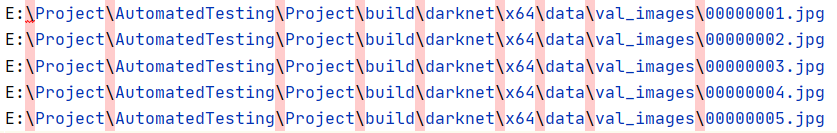
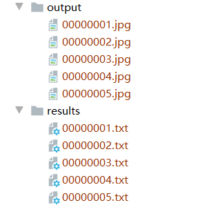
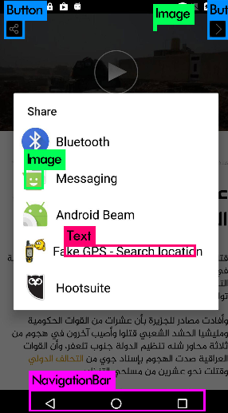
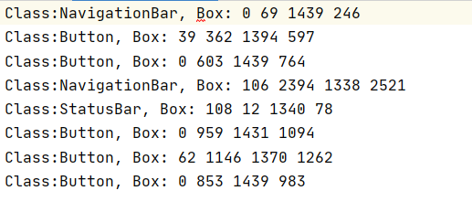
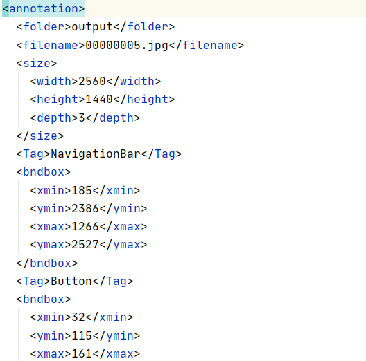

# AutomatedTesting2020

姓名：吴天池

学号：181250158

选题方向：移动应用

***

## 模型分析

### 模型结构

- 该模型分为两个部分，数据解析和控件识别。数据解析的主要工作是通过所给的JSON文件提取控件做标记，空间识别通过YOLOv3模型进行深度学习。

- 控件被分为9类，有优先级

- classes = {'NavigationBar': 0, 'Header': 1, 'Button': 2, 'Picker': 2, 'StatusBar': 3, 'Video': 3, 'Image': 4,
            'Text': 5, 'Bar': 5}

### 运行步骤

##### 所有脚本均在Script中给出

###### Step1

- 将所给数据集ATMobile2020-1分成Img和JSON两个部分，Img变焦到1440 * 2560

- DataAnalysis负责提取Data文件夹下JSON文件的关键信息，分别为所在节点的级数(emm在控件优先级判断的时候用到，不过我想可以在后续控件关系的时候有用)，class，resource-id，
  根据后两个信息给控件打上标记，然后通过截图的方式检验(检验标记有没有错误),生成的TXT文件放在Demo文件夹下

- TXT2XML负责将之前的关键性息转化为VOC格式的XML文件，存放在Demo文件夹下(然后就可以开始训练模型XP)

##### Step2 VOC2007

- 图片放在/JPEGImages下，XML文件放在/Annotations下

- 训练要求的数据格式为VOC格式，分别记录类名，归一化的坐标

- 通过voc_label.py将XML文件进行归一化处理，转化为YOLOv3标准的TXT文件，存放在labels文件夹中

##### Step3 模型训练
(由于笔记本是核显，在同学电脑上进行gpu训练，在此特别感谢杜铭泽的帮助)

- 选用YOLOv3模型，darknet框架进行训练。

- 将归一化的TXT文件和图片放入训练集中，修改配置模型，然后经过5000次迭代得到权重

- 编译生成darknet_no_gpu.exe,到该目录下执行darknet_no_gpu.exe detector test data/obj.data yolo-obj.cfg yolo-obj_5000.weights 路径，然后可以得到预测的图片

- 在/build/darknet/x64/data/val_images中放要测试的图片

- 通过/build/makeDir.py脚本将测试集的绝对路径记录在/build/darknet/x64/data下的val.txt文件

- 通过/build/AutoExec.py脚本能供自动执行darknet.exe

- 输出的带标记的图片放在/build/darknet/x64/output文件夹

- 控件类别和坐标放在/build/darknet/x64/results文件夹

- 通过/build/TXT2XML.py脚本，将TXT文件转化为XML格式，存放在/build/darknet/x64/XML文件中(如果要控件信息就在这里面拿)

### 验证结果

经过5000次迭代训练后得到的权重loss为6%，能够识别控件类别和坐标

## 结果示例

查看ouput文件夹下做过标记的图片

查看results文件夹下的文本解释

查看XML文件

## 视频链接

链接：https://pan.baidu.com/s/1cilJBvXOSYggYXvDUFmrCg 
提取码：lo31 

### 相关参考文献

https://github.com/AlexeyAB/darknet
https://blog.csdn.net/kk123k/article/details/86696540

## 个人感想

移动测试的大作业难度还是挺大的，数据解析有很多细节要注意。模型的训练因为我笔记本的原因根本跑不了，一开始用了Google的Colab，但是网速很差模型跑了很久
都没跑完，然后才在同学的笔记本上训练，再次感谢杜铭泽同学的帮助XP。做完成就感还是很高的，DL真好用(hahaha)